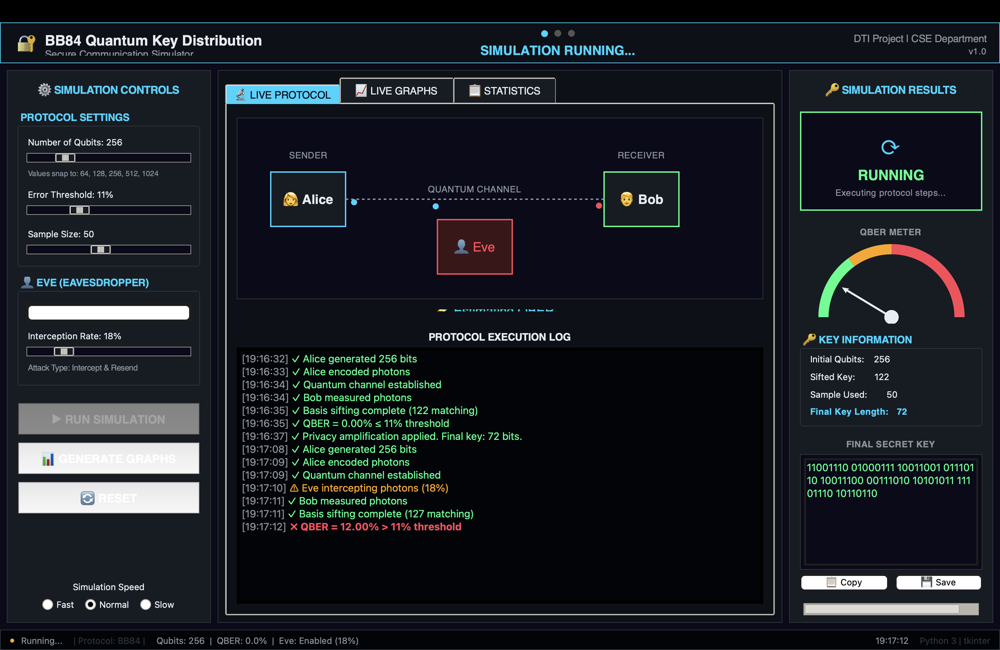

<div align="center">

# 🔐 BB84 Quantum Key Distribution Simulator

**Secure Communication Channel with Real-Time Eavesdropper Detection**


> A full Python simulation of the BB84 Quantum Key Distribution protocol with live animations, eavesdropper detection, embedded graphs, and a professional dark-themed GUI.



</div>

---

## 🧠 What Is This?

This is a **Project**  that simulates the **BB84 protocol** — the world's first quantum key distribution scheme (Bennett & Brassard, 1984).

Traditional encryption (RSA, ECC) can be broken by quantum computers. QKD is different — its security is **guaranteed by the laws of physics**. Any eavesdropping attempt is **physically detectable**.

---

## ⚛️ How BB84 Works

| Step | Action |
|------|--------|
| 1 | Alice generates random bits and encodes them as polarized photons |
| 2 | Photons travel through the quantum channel (Eve may intercept) |
| 3 | Bob measures photons using a randomly chosen basis |
| 4 | Alice and Bob compare bases publicly — keep only matching ones (sifted key) |
| 5 | Calculate **QBER** from a sample of the sifted key |
| 6 | QBER ≤ 11% → Key is secure ✅ &nbsp;&nbsp; QBER > 11% → Abort ❌ |

**Why does Eve cause errors?**  
Eve guesses Alice's basis correctly only 50% of the time. Wrong guesses introduce a 50% error at Bob's end → QBER ≈ **25%** under full interception. This is the physical fingerprint of an attack.

---

## ✨ Features

- 🔬 Full BB84 protocol from scratch (Alice → Eve → Bob → QBER → Privacy Amplification)
- 🎬 Live photon animation across the quantum channel
- 📊 Real-time QBER meter with animated semicircular gauge
- 🎨 Professional dark-themed GUI (Tkinter + Matplotlib embedded)
- 📋 Color-coded execution log (green = success, red = abort, orange = warning)
- 👤 Configurable Eve with 0–100% interception rate
- 📈 4 live graphs: QBER comparison, QBER vs qubits, protocol flowchart, statistics
- 🔑 Copy or save the final generated key with one click
- ⚡ Non-blocking simulation via threading

---

## 📁 Project Structure
BB84-QKD-Simulator/
├── alice.py          ← Bit generation, photon encoding
├── bob.py            ← Measurement, basis sifting
├── eve.py            ← Intercept-and-resend attack
├── qber.py           ← QBER calculation, threshold detection, privacy amplification
├── main.py           ← CLI runner (5 scenarios)
├── visualize.py      ← Graph generation (4 plots)
├── gui.py            ← Full GUI application
├── test_all.py       ← 15+ unit tests
├── requirements.txt
└── results/          ← Auto-generated graphs saved here

---

## 🛠 Installation & Run

```bash
# Clone
git clone https://github.com/yourusername/BB84-QKD-Simulator.git
cd BB84-QKD-Simulator

# Install dependencies
pip install -r requirements.txt

# Launch GUI (recommended)
python gui.py

# Or run CLI scenarios
python main.py

# Run tests
python test_all.py
```

---

## 📊 Expected Results

| Scenario | Eve Active | Interception | Expected QBER | Result |
|----------|-----------|-------------|--------------|--------|
| Normal | ❌ | 0% | ~0–3% | ✅ Key Generated |
| Partial Attack | ✅ | 50% | ~12–13% | ❌ Aborted |
| Full Attack | ✅ | 100% | ~25% | ❌ Aborted |

---

<div align="center">

**Built with ❤️ in Python &nbsp;|&nbsp; Quantum Security is the Future**

⭐ Star this repo if it helped you understand QKD!

</div>
